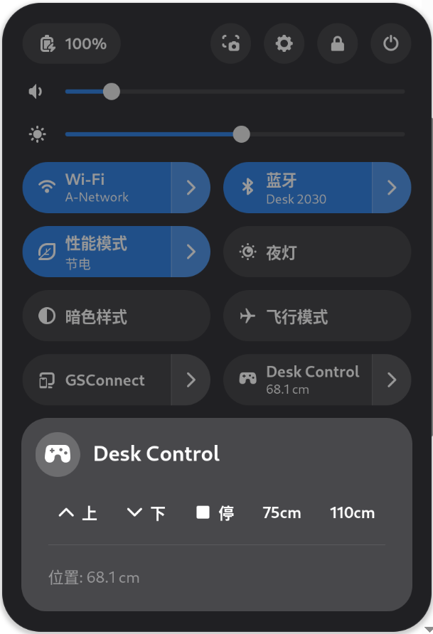

# Linak 升降桌 GNOME 控制器

一个用于控制 Linak 蓝牙升降桌的 GNOME Shell 扩展和 Go 语言守护进程。本项目由 Antigravity 生成。



## 特性

- **原生集成**：深度集成至 GNOME 快速设置菜单，界面简洁，响应迅速。
- **精确操控**：支持长按按键持续升降，松开按键立即停止。
- **会话管理**：通过 Systemd 与 GNOME 会话同步，实现自动启动和关闭。
- **实时高度显示**：展开快速设置菜单时，实时异步获取并更新桌子当前高度。

## 安装指南

运行项目提供的自动化安装脚本，即可一键完成 Go 守护进程编译、Systemd 服务注册及 GNOME 扩展安装：

```bash
chmod +x install.sh
./install.sh
```

**安装后操作：**

1. **注销并重新登录**（或重启电脑）以让系统加载新安装的 GNOME Shell 扩展。
2. 通过命令行或“扩展” App 启用它：
   ```bash
   gnome-extensions enable linak-desk@asa.github.io
   ```
3. 点击屏幕右上角的快速设置面板（网络/音量图标区域），即可看到 “Desk Control” 并开始控制。

## 技术架构

- **Go 后台**：基于 `tinygo.org/x/bluetooth` 实现低功耗蓝牙通信，并通过 `godbus` 提供 IPC 服务。内置内存安全并发处理及自动重连机制。
- **GNOME 扩展**：基于 GJS 开发，通过 DBus 与守护进程通信。利用原生 `button-press-event` 和 `button-release-event` 信号实现精确的触感控制。
